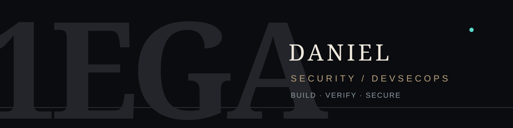

  

  # Hi 👋, I'm Daniel

  ### Security · DevSecOps · SRE

  I turn security checks into practical steps for the people who build and run software.

  [DevSecOps for All](https://github.com/1ega/devsecopsforall) · [Security rules](https://github.com/1ega/devsecopsforall/tree/main/rules) · [Guides](https://github.com/1ega/devsecopsforall/tree/main/guides)

 

### 👨‍💻 What I work on

- 🔐 **Application security:** secure code review and Semgrep rules.
- ⚙️ **DevSecOps:** repeatable checks in CI/CD and the software supply chain.
- ☁️ **Infrastructure:** Kubernetes, IaC, and runtime security.
- 🧭 **Practical guidance:** findings that explain the next safe step.

My open-source home for this work is **[DevSecOps for All](https://github.com/1ega/devsecopsforall)**.

 

### 🧰 Explore the work

- **[Semgrep rules](https://github.com/1ega/devsecopsforall/tree/main/rules)** — Python security checks with examples and tests.
- **[Mobile security rules](https://github.com/1ega/devsecopsforall/tree/main/semgrep-rules/mobile_custom)** — Android, iOS, React Native, and Flutter.
- **[Security skills](https://github.com/1ega/devsecopsforall/tree/main/skills)** — reusable instructions for AppSec, supply chain, Kubernetes, AI security, detection, and compliance.
- **[Field guides](https://github.com/1ega/devsecopsforall/tree/main/guides)** — security review and pentest planning checklists.

### 🛠️ Languages and tools

**Cloud, DevOps and platform**

  

**Security tooling**

  
  
  
  

### 🤝 Connect

Have an idea for a rule, a guide, or a useful tool? [Open an issue](https://github.com/1ega/devsecopsforall/issues). For vulnerabilities in the project, follow its [security policy](https://github.com/1ega/devsecopsforall/blob/main/SECURITY.md).
